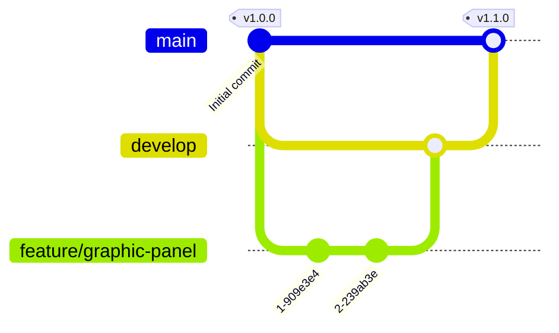

# Contributing to ÆRIS

After cloning this project, open it with [VSCode](https://code.visualstudio.com/download) (or your editor of choice) and follow the instructions below according to your needs.

_Don't forget to commit your changes using [Conventional Commits](https://www.conventionalcommits.org/en/v1.0.0/) messages._

## Development

Before you start coding, check the [Scripts](#scripts) below.

### Scripts

- Install dependencies:

```bash
npm install
```

- Run the app locally:

```bash
npm start
```

## Documentation

Documentation for this project lives in a separate repository: [xarc/aeris-docs](https://github.com/xarc/aeris-docs).

Any change you make here that affects behavior, instructions supported, UI, or setup **must** be documented there in the same pull request cycle. Don't merge a change here without a corresponding update (or a follow-up PR, opened right away) on `aeris-docs`. When opening a PR on this repo, reference the related `aeris-docs` PR (or issue) in the description.

## Opening a Pull Request

This project follows [GitFlow](https://www.atlassian.com/git/tutorials/comparing-workflows/gitflow-workflow). Keep in mind we have two long-living branches:

- `main`: always deployable. Pushing here triggers CI (`.github/workflows/prd.yaml`), which builds the app and publishes it to the `prod` branch (served on GitHub Pages). **Never push to `prod` directly**, it's a build artifact, fully managed by CI.
- `develop`: the integration branch. Finished features land here first.

Every short-lived branch is a `feature/*` (named after its intention, e.g. `feature/graphic-panel`), created from `main`. Open your Pull Request against `develop`, not `main`. Once merged, delete the branch. The team then evaluates `develop` and decides when it's ready to be merged into `main`, which triggers the deploy and generates a new version.



Both `main` and `develop` are protected against direct pushes. Every change goes through a reviewed Pull Request.

## Reporting bugs

Found a bug? [Open an issue](https://github.com/xarc/aeris/issues/new/choose) and follow the template.
